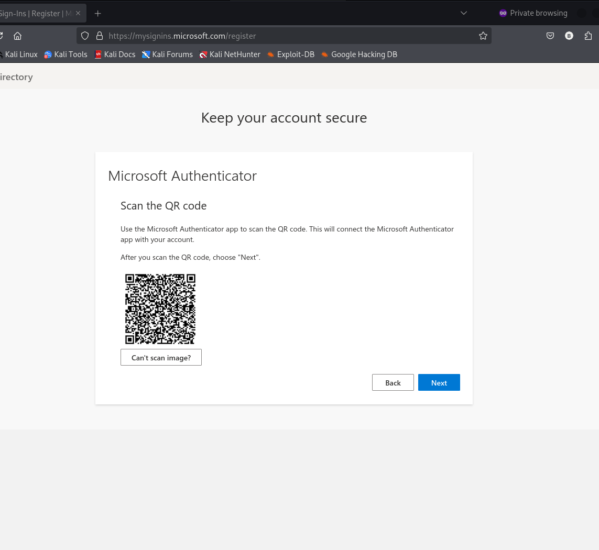

# Azure Entra ID Attack Simulation (Blue-Team Focus)

> **Purpose**: Show realistic **identity attack paths** in a *lab* tenant and how to **detect & mitigate** them.
> **Scope**: Safe, high-level simulations only — no exploit code or illegal activity.

## Attack Paths Simulated (Blue-Team Focus)

- **Password reset / session hijack** → Mitigated by MFA (Conditional Access)
- **Privilege abuse of executive accounts** → Scoped CA policy to "Executives" group
- **Bypass of Security Defaults** → Disabled defaults to show custom CA hardening
- **Sign-in monitoring** → Enforced MFA and verified via Sign-in logs

## Contents
- `setup/` – step-by-step lab preparation
- `scenarios/` – safe simulation guides to generate logs/evidence
- `detections/kql/` – KQL queries for AuditLogs/SigninLogs
- `mitigations/` – hardening guides & policy baselines
- `architecture/` – diagrams and policy matrix
- `report/` – executive summary & findings templates
- `evidence/` – put **sanitized** screenshots/log snippets here
- `push-to-github.md` – exact commands to publish this repo

## Quick Start
1. **Read** `setup/tenant-prereqs.md` and complete logging + permissions.
2. **Create/verify** users & groups per `setup/users-groups.md` (you can keep your own; just map them).
3. **Create two app registrations** (`setup/app-registrations.md`).
4. **Baseline hardening** (`mitigations/baseline-hardening.md`) and **Conditional Access** (`mitigations/ca-best-practices.md`).
5. **Run scenarios** in `scenarios/` to generate evidence.
6. **Run KQL** in `detections/kql/` to validate detections.
7. **Write-up** results in `report/` with screenshots under `evidence/`.
8. **Publish** with `push-to-github.md`.

## Ethics & Scope
- This repository is for **defensive education** in a **lab tenant** that you control.
- Never target production tenants or third parties. Redact all identifiers in evidence.
- No secrets/keys/tokens are stored in this repo.

## Evidence (Screenshots)

1. Reset password for Taylor Admin  
   

2. First sign-in action required (MFA prompt)  
   

3. MFA QR code setup  
   

4. Admin Center overview (Taylor Admin)  
   

5. Assign Entra ID P2 license  
   

6. Disable Security Defaults  
   

7. Create Conditional Access policy (Executives MFA)  
   

8. Policy in **Report-only** mode  
   

9. Policy **Enforced** (On)  
   

10. Sign-in logs – **Report-only** evaluation  
    

11. Sign-in logs – **Enforced** (MFA required)  
    

12. Lars CEO signed in (policy applied)  
    
